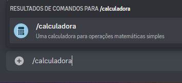
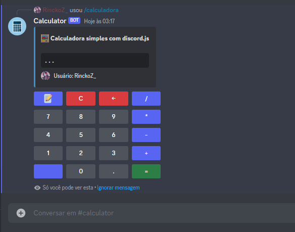
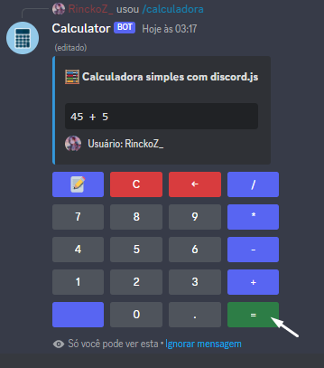
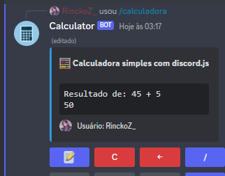
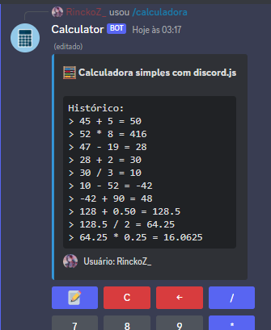
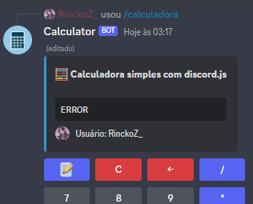

# Calculator Bot

Apenas uma calculadora simples feita em um bot de discord.
O bot é escrito em typescript, utiliza `discord.js v14` e os recursos de comandos de barra (Slash Commands).

## Como utilizar

O uso é bem simples, o bot tem apenas um comando: `/calculadora`

Após executar o comando, uma resposta com botões será enviada ao usuário de forma efêmera para que ele possa utilizar a calculadora sem interrupções de outros usuários no canal de texto.

Ela realiza operações matemáticas simples, tem um input interativo onde o usuário pode adicionar números, operadores, apagar e limpar

Após montar a conta utilizando os botões, basta clicar no botão de resultado em verde

A mensagem será editada e o resultado será exibido

É possível continuar a operação a partir do número do resultado anterior.
O botão vermelho "C" limpa o input inteiro e o botão "←" apaga o último item inserido.

## Histórico de operações

Todas as operações concluídas são salvas temporariamente na "sessão" da calculadora. A sessão inicia quando o usuário executa o comando e encerra quando ele clica em **ignorar mensagem** ou se a mensagem sumir

Para ver o histórico basta clicar no botão com o emoji 📝

Caso o histórico exceda o limite de caracteres do embed, ele será enviado em formato de texto no chat!

## Operação inválida

Se o usuário digitar uma operação inválida, "ERRO" é exibido no input

